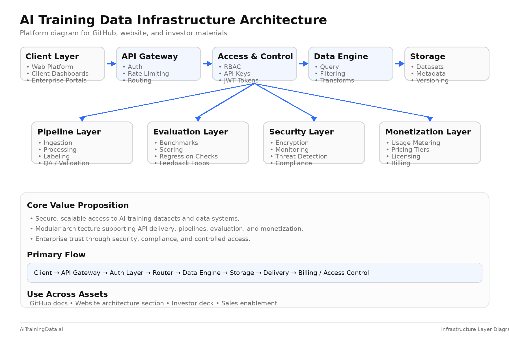

# 🏗️ AI Training Data Infrastructure

Infrastructure layer for building, scaling, and monetizing AI training data systems.

This repository defines the **core systems powering AI training data pipelines**, agent workflows, APIs, and data access control.

---

## 🌐 Platform

👉 https://aitrainingdata.ai

---

## 🧠 Overview

Modern AI systems are not just models.

They are **full-stack data systems**:

- data pipelines
- feedback loops (RLHF)
- evaluation systems
- agent orchestration
- APIs + access control
- monetization layers

This repository focuses on the **infrastructure layer** that makes all of this scalable.

## 🧭 Architecture Overview
 

 

> **Figure 1 — AI Training Data Infrastructure Architecture**  
> End-to-end system covering data pipelines, evaluation systems, access control, and monetization layers.

---

## ⚡ Core Infrastructure Layers

### 1️⃣ Data Pipeline Infrastructure
- ingestion systems
- ETL pipelines
- data transformation
- storage systems

### 2️⃣ Agent Orchestration Layer
- task routing
- workflow automation
- multi-agent coordination
- job scheduling systems

### 3️⃣ API Layer
- dataset access APIs
- inference data endpoints
- secure data delivery
- signed URLs + authentication

### 4️⃣ Access Control + Security
- role-based access
- API keys + auth systems
- paywall + gated data access
- rate limiting + abuse prevention

### 5️⃣ Evaluation Infrastructure
- benchmarking systems
- performance tracking
- regression testing
- continuous evaluation pipelines

### 6️⃣ Monetization Layer 💰
- usage-based pricing
- API billing systems
- dataset licensing models
- enterprise access tiers

---
---

## 🛠️ Tech Stack

- Python (FastAPI, data pipelines)
- Node.js (API services)
- Vector DBs (Pinecone, Weaviate)
- Cloud (AWS, GCP, Azure)
- Object Storage (S3)
- Queue systems (Redis, Kafka)
- Orchestration (Temporal, Celery)

---

## 🔐 Security + Data Control

- authenticated API access
- signed URLs for dataset delivery
- no direct public data exposure
- rate limiting + bot control
- enterprise-grade data governance

---

## 💡 Monetization Strategy

This infrastructure enables:

- pay-per-dataset access
- API usage billing
- enterprise contracts
- private data pipelines
- premium dataset licensing

---

## 🧩 Use Cases

- AI startups training models
- robotics + autonomous systems
- enterprise AI deployments
- defense + simulation environments
- healthcare AI systems

---

## 🔗 Ecosystem

- Playbooks → https://github.com/AITrainingDataAI/ai-training-data-playbooks
- Agents → https://github.com/AITrainingDataAI/ai-training-data-agents
- Datasets → https://github.com/AITrainingDataAI/ai-training-data-datasets

---

## 📩 Work With Us

👉 https://aitrainingdata.ai

Custom:
- dataset engineering
- RLHF systems
- AI data infrastructure
- performance optimization

---

## ⚠️ Disclaimer

We provide infrastructure and data systems.

We do **not guarantee model outcomes**, as performance depends on:
- model architecture
- training process
- deployment environment

---

## 👩‍💻 Author

**Rhonda Coleman Albazie**  
Founder • Operator • CTO  
AI-Native | Robotics-Native | Cloud-Native | Cyber-Native | Physics-Native  

🌐 https://aitrainingdata.ai

---

## ⭐ Final Note

AI doesn’t scale without infrastructure.

This repository defines the systems behind the next generation of AI.

## 🏗️ System Architecture

